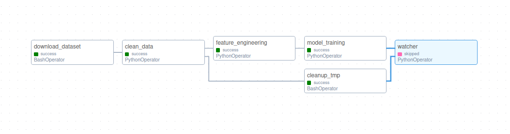

# RiskThinking.AI work sample


Andrei Stoica<br>
May 23, 2023

-------

This is my work sample submission for Data Engineer at RiskThinking.AI.
Refer to [this readme](https://github.com/RiskThinking/work-samples/blob/2acaaa99257de21992d8cf756c50e4ddba6d4312/Data-Engineer.md)
for details.


## Setup
BufEnter
A [Kaggle](kaggle.com/) API token is required for downloading th dataset.
It can me created on your account settings page:
[https://www.kaggle.com/settings](https://www.kaggle.com/settings)

Place the generated token in the `airflow-docker` directory.

Setting up Airflow environment
```sh 
mkdir data
docker compose build
docker compose up airflow-init
docker compose up
```

### Testing
#### Unit tests

Create local env and activate it
```sh
python -m venv .venv
. .venv/bin/activate
```

Install dependencies
```sh
pip install -r requirements.txt
```

Run tests
```sh
pytest ./tests
```
## Pipeline

The DAG set to run daily. I was thinking that a *real* pipeline such as this
one would run only retrieve the latest day's data and update an existing 
dataset. Then it would train or even update the weights of an existing model
based on the new data. Since this dataset is static, the current implementation
retrieves the entire dataset every time and trains a new model.



1. Problem 1: `clean_data`/`download_dataset`/`cleanup_tmp`

   This only uses local storage. It is loaded in a tmp folder that is then
   cleaned up after all files are parsed and saved in a standardized format.


2. Problem 2: `feature_engineering`

3. Problem 3: `model_training`

    The RandomForestRegressor from the example code could not run on my
    machine with this dataset due to memory limitations. So the decision
    to switch was practical one.
    After some internet research, I discovered an article that compared
    multiple models at this exact task. CatBoost had the best performance.
    That being said, the performance it exhibited in that write-up was
    highly influenced by recent futures trading volumes. This dataset
    does not include volume for futures and options.
    It would be interesting to try some of the training methodologies from
    LLMs. I suspect adapting BERT's masked language model would be suitable
    here due to the reactive nature of the market. Knowledge of the future
    could help make sense of patterns. I would also like to add the
    derivatives market to the dataset since it showed to have great impact
    in the article stated earlier.

    SOURCES:

    [Trading volume prediction](https://medium.com/machine-learning-with-market-data/trading-volume-prediction-on-the-example-of-nasdaq-index-futures-6033de7ba716)


    The data preparation follows the example code. However, if goal of this
    model is to predict the next days volume I propose that the features should
    be from day `x` and the target should be from day `x+1`.

4. Problem 4: `git submodule rt-api`

    The api is hosted with render and can be accessed at
    [rt-ws.andreistoica.ca/predict](https://rt-ws.andreistoica.ca/predict?vol_moving_avg=12345&adj_close_rolling_med=25)

    Deployment setup:
    - [Render](https://render.com) free tier
    - automatic deploy on push to main

    Limitations:
    - automatically spun down after 15 minutes without requests and spun back up
    when a new request is issued
        - model is loaded on launch every time
        - longer cold boot time
        - inference time seems to be acceptable after cold boot
    - Free tier does not support a persistent disk
        - model changes need to be committed to git repository
    
    Possible future iteration:
    - Paid instance on Render
        - No more cold boot problem
        - take advantage of Render's scaling features for load balancing
    - S3 for model storage
        - load from S3 into memory on launch
        - when a request is made, check for new models then load it
        asynchronously for future requests.